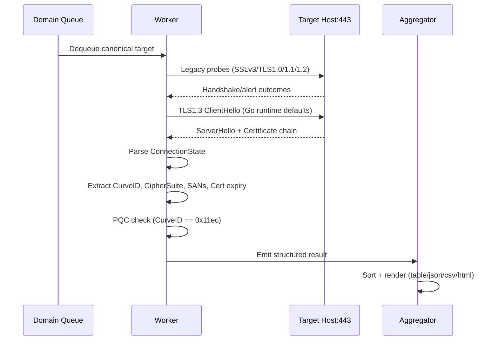

# cipher-scan-go

`cipher-scan` is a high-throughput TLS reconnaissance utility for quantifying protocol posture and Post-Quantum Cryptography (PQC) negotiation at internet scale.

It is designed for security engineering teams running migration programmes from classical key exchange to NIST-standardised hybrid key exchange, with deterministic output for CI/CD and SOC pipelines.

---

## Why this tool exists

PQC migration is not a binary state. During transition, many endpoints support both classical and hybrid key exchange, and the negotiated result depends on runtime behaviour, client offer sets, and server preference order.

`cipher-scan` performs cryptographic protocol discovery by executing real TLS handshakes and analysing negotiated server parameters, including:

- TLS protocol acceptance (SSLv3 to TLS 1.3)
- negotiated TLS 1.3 cipher suite
- negotiated key exchange group codepoint
- explicit PQC negotiation state
- certificate SANs as infrastructure recon signals

For PQC, the scanner identifies **X25519MLKEM768** using codepoint **`0x11ec`**.

---

## Architecture overview

### Strict vs Optimistic interpretation model

The scanner uses a barbell interpretation strategy during migration:

- **Strict side:** mark `PQC_NEGOTIATED=true` only if negotiated group is `0x11ec`.
- **Optimistic side:** still capture TLS 1.3, cipher, SANs, and legacy protocol acceptance for transitional visibility.

This prevents false-positive PQC claims while preserving operational context for phased remediation.

### Single scan lifecycle



---

## Concurrency model

`cipher-scan` uses a worker pool pattern built on Go channels and `sync.WaitGroup`.

- configurable worker count (`--concurrency`, default `20`)
- bounded fan-out to prevent socket exhaustion
- network I/O is parallelised per target
- result aggregation is deterministic and sorted for reproducibility

This architecture scales well for internet-facing estate scans where latency dominates compute.

---

## Performance and reliability

### Timeout management

Each target is scanned with `context.WithTimeout` to prevent hanging hosts from stalling the batch.

- default timeout: `8s` (`--timeout`)
- protects against tarpitted or rate-shaped endpoints
- per-target failure is isolated, never fatal to the whole run

### Input normalisation engine

Targets are normalised into canonical domain form before queueing.

- strips `http://` and `https://`
- trims paths and trailing slashes
- deduplicates inputs
- supports positional domain or file-driven batch mode

---

## Go runtime and PQC enablement behaviour

For Go 1.26+, the tool can auto-restart itself with `GODEBUG=tlsmlkem=1` when needed, preserving all CLI arguments.

- this improves PQC detection reliability where runtime defaults disable ML-KEM negotiation
- no manual flag choreography required for operators
- diagnostics are available with `--debug`

If you need control for testing, set environment explicitly:

```bash
GODEBUG=tlsmlkem=0 ./cipher-scan cloudflare.com
GODEBUG=tlsmlkem=1 ./cipher-scan cloudflare.com
```

---

## Build

```bash
cd tools/cipher-scan-go
./build.sh
```

Produces:

- `cipher-scan` (Linux)
- `cipher-scan.exe` (Windows)

---

## Usage

### Single target

```bash
./cipher-scan cloudflare.com
```

### Batch mode

```bash
./cipher-scan --file domains.txt --concurrency 40 --timeout 10
```

### Debug diagnostics

```bash
./cipher-scan --debug cloudflare.com
```

### Output formats

```bash
./cipher-scan cloudflare.com --output table
./cipher-scan cloudflare.com --output json
./cipher-scan cloudflare.com --output csv
./cipher-scan cloudflare.com --output html
```

### Metadata and easter egg

```bash
./cipher-scan -a
./cipher-scan -m
./cipher-scan --mando
```

---

## Default table columns

- `DOMAIN`
- `PQC_NEGOTIATED`
- `CURVE_ID`
- `CURVE_LABEL`
- `TLS1.3`
- `TLS1.2`
- `TLS1.1`
- `TLS1.0`
- `SSLv3`
- `RELATED DOMAINS`
- `CERT DAYS`
- `CERT EXPIRY`
- `NOTES`

---

## DevSecOps integration

### JSON for pipeline ingestion

```bash
./cipher-scan --file domains.txt --output json > cipher-scan.json
```

Example fields:

- `domain`
- `pqc_supported`
- `pqc_curve_id`
- `pqc_curve_label`
- `cipher_tls13`
- `subject_alt_names`
- `cert_days_remaining`
- `error_summary`

### CSV for analyst workflows

```bash
./cipher-scan --file domains.txt --output csv > cipher-scan.csv
```

Use this for SIEM enrichment, risk registers, or board-level migration reporting.

---

## Interpreting PQC results

- `PQC_NEGOTIATED=true` means negotiated key exchange was `0x11ec` (X25519MLKEM768).
- `PQC_NEGOTIATED=false` with TLS 1.3 true often indicates classical fallback, commonly `0x001d` (X25519).
- During migration, this is expected for mixed estates and policy-gated rollouts.

---

## Operational notes

- Legacy protocol probes are best-effort and may be rejected by modern edge controls.
- SAN extraction is recon-relevant and can reveal sibling infrastructure.
- Use `--debug` when validating runtime/env effects or diagnosing handshake policy drift.
